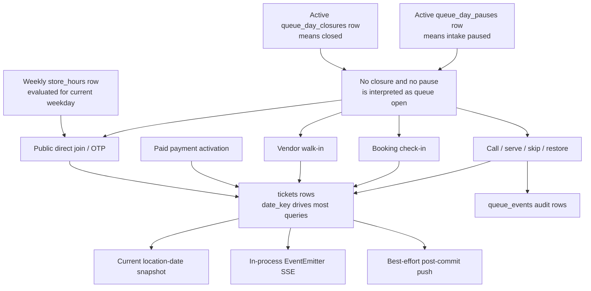

# Current queue availability and stale-ticket audit

Date: 2026-07-29
Scope: current repository behavior before the reliable Queue Day lifecycle is introduced.

## Executive finding

GetPrio does not currently own an explicit daily queue-opening lifecycle. A location's queue is treated as open when there is no active closure or pause for the computed date. Store-hours eligibility is evaluated separately for public join requests, but it is not enforced by every ticket-creation path or vendor operation. At midnight, most live views switch to a new date while unresolved rows retain their old active statuses. Those rows can therefore become invisible to the operating board without reaching a terminal outcome.

The later design must not be implemented as a UI countdown plus a process timer. It needs a location-scoped, database-owned Queue Day transition with explicit opening, idempotent reconciliation, one authoritative location-timezone date, deterministic ticket outcomes, and durable event/notification semantics.

## Authoritative current-state diagram



The diagram exposes four different owners that currently disagree:

| Concern | Current owner | Current guarantee |
| --- | --- | --- |
| Store eligibility | [`storeHoursService.js`](../../../backend/src/services/storeHoursService.js) | Public direct join is rejected outside today's weekly hours. |
| Queue availability | Absence/presence of closure and pause rows in [`queueService.js`](../../../backend/src/services/queueService.js) | No explicit `unopened` or `open` Queue Day exists. |
| Operational date | Mixed use of app timezone and location timezone | Mutations and snapshots can address different dates. |
| Ticket visibility | Current-date filters in [`queueSnapshotHelpers.js`](../../../backend/src/services/queueSnapshotHelpers.js) | Old active tickets disappear from the live board at date rollover. |
| Transition serialization | Individual SQL updates/transactions | No location/date lifecycle lock serializes close, call, restore, cancel, or payment activation. |
| Realtime delivery | Process-local [`queueEvents.js`](../../../backend/src/services/queueEvents.js) | Only subscribers connected to the same backend process receive a mutation signal. |
| Customer notification | Best-effort post-commit channel calls | Queue lifecycle delivery is neither durable nor cross-process idempotent. |

## What the implementation guarantees today

1. Public direct join, OTP request, and OTP verification check the resolved location's store-hours status before allowing the request. See [`publicRoutes.js`](../../../backend/src/routes/publicRoutes.js) and [`storeHoursService.js`](../../../backend/src/services/storeHoursService.js).
2. The ordinary `createTicket` path rejects an active Queue Day closure or pause. See `assertQueueDayOpen`, `assertQueueIntakeOpen`, and `createTicket` in [`queueService.js`](../../../backend/src/services/queueService.js).
3. Close executes ticket status/date changes, closure persistence, and queue event inserts in one database transaction.
4. Called tickets become `unserved` at close and waiting tickets are moved to a computed next date with `carry_over_count` incremented.
5. Reopen attempts to reverse the current closure: affected `unserved` tickets return to waiting and affected carry-over tickets move back to the original date.
6. Waiting selection prioritizes `carry_over`, then `recovery`, then `checked_in_booking`, then `normal`. See [`tickets.js`](../../../backend/src/repositories/tickets.js).
7. Existing focused route/repository/helper tests pass, but they primarily prove route contracts and query shapes rather than concurrent lifecycle correctness.

These are useful building blocks, not a complete Queue Day contract.

## Stale or invisible ticket paths

### 1. Midnight rollover without close

Live snapshots query waiting, called, recovery, and history rows for the location-timezone current date. A previous-day `waiting`, `called`, or `skipped` ticket retains its active/nonterminal status but drops off the board after midnight. The vendor close endpoint always targets its computed current date, so the normal API cannot close yesterday retroactively.

Consequences:

- staff no longer see the unresolved ticket in the main queue;
- public lookup can still find it by lookup code and present an old-day position;
- customer account history can still show it as waiting/called;
- no carry-over, expiration, or unserved event has occurred.

### 2. Skipped restoration after the original day

`restoreSkippedTicket` uses the current date to check queue closure/pause, but the repository restores the row without moving its `date_key`. The recovery deadline only controls whether the restored priority band is `recovery` or `normal`; it does not make restoration unavailable. An old skipped ticket can therefore be restored indefinitely into `waiting` on its old date and remain absent from today's board.

### 3. Paid payment settlement after availability changed

Checkout begins behind the public hours checks, but later sync/webhook activation calls `issueTicketForPaidPayment`, locks the payment, and invokes `createTicketForTenantInTransaction` directly. That transactional helper does not assert store hours, active Queue Day closure, or pause. A payment settling after closing time, after manual close, or after date rollover can issue a waiting ticket into a queue customers could no longer join directly.

This path also bypasses the normal `ticket_created` queue event.

### 4. Vendor-side ticket creation outside store hours

Vendor walk-ins check closure/pause through `createTicket` but do not check effective store hours. Booking check-in similarly checks queue intake but not store hours. These may remain permitted operational actions later, but today the behavior is implicit and conflicts with a single definition of availability.

### 5. Waiting notification selection across dates

`maybeNotifyUpcomingTickets` calls `listWaitingTickets` without a date key. Old waiting tickets can enter the “almost next” ordering, receive stale notifications, or prevent current-day tickets from occupying notification positions. See [`queueAutomationHelpers.js`](../../../backend/src/services/queueAutomationHelpers.js).

### 6. Indefinite carry-over

Every close carries every waiting ticket to calendar tomorrow and increments its count. No maximum is enforced and no `expired` status exists. A ticket can be carried repeatedly, including through store-closed days, with no deterministic terminal outcome.

### 7. Closed-day and late-close invisibility

The computed next date is now plus 24 hours in the app timezone, not the next eligible location business day or next opened Queue Day. A carried ticket can land on a closed weekday and remain invisible when the next actual opening uses another date. A close performed after midnight targets the new day and cannot reconcile the previous day through the public service API.

### 8. Old `unserved` and skipped history omissions

Vendor queue history selects `served`, `skipped`, and `cancelled`, not `unserved`. An unserved ticket can therefore be absent from the normal vendor history even though its outcome is stored. Old skipped tickets are also hidden by current-date snapshot filtering.

### 9. Linked booking drift

Closing a called queue ticket as `unserved` does not settle the linked booking lifecycle. A checked-in booking can retain its booking status and queue-ticket link while its ticket is unserved or later reopened. This needs an explicit compatibility rule; silently changing booking semantics is outside this map.

## Availability and time defects

### “Open” is inferred, not recorded

[`shared/types.ts`](../../../shared/types.ts) exposes only `isClosed` and `isPaused` for Queue Day status. [`queueService.js`](../../../backend/src/services/queueService.js) treats the absence of active closure/pause rows as intake open, and [`VendorDashboardPage.tsx`](../../../frontend/src/pages/VendorDashboardPage.tsx) labels that state “Queue day open.” There is no durable opening actor, opening timestamp, unopened state, warning state, extension deadline, or lifecycle version.

This directly conflicts with the destination rule that each eligible Queue Day starts unopened and staff manually open it like a physical store.

### App timezone and location timezone are mixed

Snapshots derive their date from the location timezone. Ticket allocation, close, reopen, pause, resume, call-next, and several service defaults derive dates from `env.appTimezone`. For a location outside the app timezone—or around DST—writes can target one date while readers show another.

`date_key` and `queue_date_key` also do not yet have cleanly separated meanings: most repository filters use `date_key`, close changes both fields, and original-day lineage survives mainly in event metadata and closure arrays.

### Overnight hours are not fully modeled

The hour predicate recognizes an `opensAt > closesAt` overnight range, but `getOpenStatus` loads only the current weekday's row. The after-midnight portion of the previous weekday's overnight interval is therefore ignored unless the new weekday independently has a compatible row.

Missing hours and explicitly closed days both return closed. Equal opening/closing times mean 24 hours. `nextOpenAt` is always `null`, and there is no holiday, exception, or temporary closure model.

### Schedule edits are not reconciled

Authorized users can replace hours while a queue is active. Replacement deletes and reinserts rows without a surrounding route-level transaction or Queue Day reconciliation. Partial failure can leave an incomplete weekly schedule, and changing today's close time does not reschedule or immediately reconcile any lifecycle deadline.

## Close/reopen transaction risks

### Close is not concurrency-idempotent

`closeQueueDay` checks for an active closure, reads affected tickets without `FOR UPDATE`, mutates them, and upserts the closure. Two close transactions can both observe “not closed.” Depending on lock timing, both can emit events/notifications and the later upsert can overwrite accurate counts with zero.

A close racing call-next, restore, cancel, check-in, or paid activation can produce a ticket state that no longer matches the recorded closure. The closure unique index is not a substitute for a queue-day scope lock.

### Reopen can duplicate side effects

Reopen lookup is not locked. Concurrent reopen requests can both work from the same affected-ticket snapshot, while only one closure update succeeds. Events and notifications can still duplicate unless the transition itself owns an idempotency boundary.

### Sequence collisions during carry-over

Carry-over changes a ticket's `date_key` but keeps its sequence. The unique key `(tenant_id, location_id, date_key, sequence)` can collide with a ticket already allocated on the destination date, especially during a late close or when today's queue was already used. No collision/resequence policy exists.

The ticket-creation retry path also expects a sequence-reservation callback that its current caller does not provide, making the rare retry path unsafe.

## Restart, deployment, and delivery assumptions

- [`server.ts`](../../../backend/src/server.ts) has no Queue Day lifecycle timer, startup reconciliation, or overdue scan. Only organizer-campaign expiry has a periodic timer.
- The documented MVP deployment currently assumes one backend process on one DigitalOcean droplet, but correctness must survive a restart between warning and close.
- A future second process or rolling deployment would duplicate timer work unless the database transition elects one winner.
- Queue SSE uses a module-local `EventEmitter`; mutations in another process do not wake a subscriber.
- Web Push deduplication is an in-memory, two-minute key. A restart loses it, another process has another cache, and the key can be claimed before delivery succeeds.
- Closure/reopen customer updates are Web Push-only for linked users. Anonymous customers and customers requesting email/SMS do not receive equivalent carry-over or unserved lifecycle notifications.
- There is no durable notification outbox or unique lifecycle notification key.

The design must therefore assume at-least-once scan/request attempts, process death at any point, and more than one backend process even if the initial production topology is single-process.

## Schema and migration compatibility risks

| Risk | Evidence | Required treatment |
| --- | --- | --- |
| Fresh-init ticket status constraints conflict | [`database/init.sql`](../../../database/init.sql) contains one check without `unserved` and another with it. | Consolidate to one canonical status constraint before adding `expired`. |
| Fresh init omits `tickets.queue_date_key` | Repository selects the field and [`20260707_add_queue_date_key_to_tickets.sql`](../../../database/migrations/20260707_add_queue_date_key_to_tickets.sql) adds it, but `init.sql` does not. | Make fresh install and upgraded schema identical. |
| Closure uniqueness differs by install history | The first closure migration creates a full unique constraint; current init/repository expect a partial unique active-closure index. | Explicitly remove/replace the legacy constraint without losing closure history. |
| No explicit Queue Day row | Only closure and pause history exist. | Introduce a lifecycle aggregate or equivalent row with a compatibility backfill rule. |
| No `expired` outcome metadata | Shared type/schema have no expired status, timestamp, reason, or source. | Add terminal outcome fields and event semantics with safe backfill. |
| Original queue-day lineage is weak | Close mutates both date fields and stores affected IDs in closure/event data. | Define stable origin/current Queue Day identity before migrating carry-over. |
| Priority-band assumptions drift | Current code recognizes `checked_in_booking`; older migration backfill enumerates fewer bands. | Preserve valid existing values and avoid destructive reclassification. |

## Behaviors to retain

- Location-scoped operations and location timezone as the intended temporal boundary.
- Server-enforced tenant permissions; UI visibility is not authorization.
- One active closure/pause concept per location/date, upgraded into a stronger Queue Day lifecycle invariant.
- Transactional ticket outcome plus audit-event writes.
- Explicit `unserved` outcome for a called ticket that cannot be served at close.
- Carry-over priority above ordinary joins.
- Public redaction and lookup-code based anonymous ticket access.
- Post-mutation snapshot publication as a UX refresh hint, while not treating it as durable delivery.
- Reopen as an audited exceptional operation, subject to the later state/outcome contract.

## Behaviors that conflict with the destination

- Absence of a closure meaning open.
- Joining solely because store hours are open.
- App-timezone mutation dates for location-scoped queues.
- Calendar-tomorrow carry-over.
- Unlimited repeated carry-over.
- Restoring old skipped tickets onto an invisible past date.
- Issuing paid tickets without rechecking Queue Day eligibility.
- A process timer as the authority for closing.
- Current-date-only reconciliation and close APIs.
- Non-durable, process-local idempotency for lifecycle notifications.
- Treating store-closed and queue-closed as one generic customer-facing state.

## Invariants later tickets must make enforceable

1. Every location/date has at most one authoritative Queue Day lifecycle state, and absence means unopened—not open.
2. A Queue Day can open only during effective store hours and only through an authorized vendor-side action.
3. Customer ticket issuance commits only while both effective store hours and that Queue Day allow intake; payment activation must use the same transactional gate.
4. Every queue mutation resolves the Queue Day using the location timezone and a stable Queue Day identity.
5. Warning, extension, close, reopen, and reconciliation are database transitions with auditable actors/sources and replay-safe idempotency.
6. A periodic scan, startup scan, and request-time check may all attempt reconciliation; exactly one transition owns the result.
7. Closing serializes against call, restore, cancel, check-in, walk-in, and paid activation for the same Queue Day.
8. A waiting ticket can carry to one next eligible *opened* Queue Day. Closed store dates and unopened dates do not consume its opportunity.
9. A once-carried waiting ticket becomes terminally `expired` when that destination Queue Day closes.
10. Called tickets close as `unserved`; served/cancelled/expired remain terminal.
11. No active ticket can become invisible merely because wall-clock date changed.
12. Lifecycle notification intent is durable and uniquely keyed even when channel delivery is retried.

## Concrete questions routed to later tickets

### Ticket 02 — Queue Day and effective-hours contract

- What are the exact Queue Day states and legal transitions?
- Does store-hours end put an open Queue Day into `warning`, `draining`, or another state before close?
- How are overnight hours, 24-hour days, absent hours, edits, and future exception hours resolved?
- What may staff do while the store is closed, before manual open, during warning, and during an extension?

### Ticket 03 — ticket outcomes

- Which statuses are eligible at manual close, auto-close, stale reconciliation, and reopen?
- How is “next eligible open Queue Day” represented without guessing a future opening?
- What happens to skipped/recovery and linked booking tickets?
- Which original/current day identifiers, timestamps, reasons, and carry count are immutable?

### Ticket 04 — idempotent reconciliation

- Which row/advisory lock serializes one location Queue Day?
- What deadline is authoritative after hours edits and extensions?
- How are warning delivery, close transition, notification intent, and scan cursor made replay-safe?
- How does reconciliation discover old unresolved days without relying on today's snapshot?

### Ticket 05 — prototype

- How does the 15-minute danger countdown remain prominent on mobile and desktop?
- Does “Cancel auto-closing” clearly communicate that it grants exactly one audited 30-minute extension?
- What does the UI show after extension, after another process closes, or when reconciliation fails?

### Ticket 06 — permissions, notifications, audit

- Which of Vendor Staff, Vendor Admin, and owner can open, extend, close, reopen, or repair?
- Which lifecycle outcomes use push, email, and SMS for linked and anonymous customers?
- What constitutes notification intent versus successful delivery?

### Ticket 07 — schema/API/rollout

- How are existing absence-means-open locations introduced without unexpectedly opening queues?
- How are legacy closure uniqueness, contradictory status constraints, and missing fresh-init columns repaired?
- What compatibility response will older clients receive during rollout?

## Verification performed

Focused current tests were run without changing data:

```text
node --test \
  backend/tests/queueHelpers.test.cjs \
  backend/tests/ticketsRepository.test.cjs \
  backend/tests/queueSnapshotHelpers.test.cjs \
  backend/tests/queueClosureLifecycle.test.cjs \
  backend/tests/queueJoinPaymentService.test.cjs
```

Result: 26 passed, 0 failed. The green result confirms existing contracts; it does not cover overnight effective-hours evaluation, lifecycle timers/restarts, previous-day reconciliation, close races, sequence collision, one-carry expiration, paid activation after close, or durable notification idempotency.
